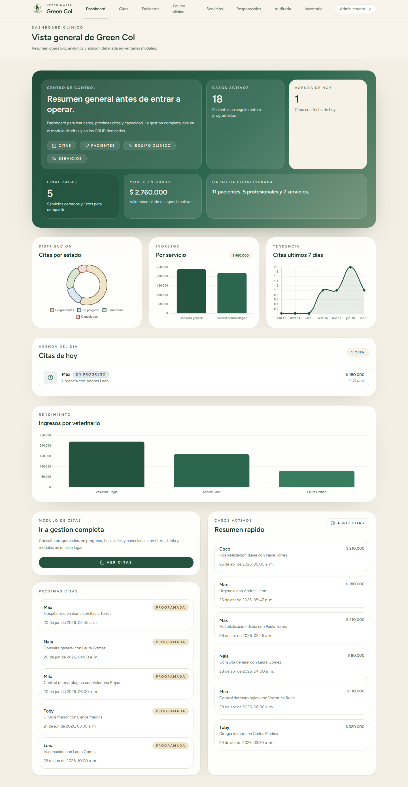

<h1 align="center">Green Col</h1>

<p align="center">Sistema de gestion veterinaria para operacion clinica diaria.</p>

<p align="center">
  
  
  
  
  
  
</p>

<p align="center">
  
  
  
  
  
</p>

---

Administra citas, pacientes, responsables, servicios y equipo clinico con seguimiento publico por WhatsApp.

<p align="center"></p>

## Caracteristicas

- **Dashboard clinico** con estadisticas, graficos de ingresos por servicio y veterinario, agenda del dia y casos activos
- **CRUD de citas** con filtros por estado, veterinario y rango de fechas, exportacion a CSV
- **CRUD de pacientes** con foto, historial clinico y linea de tiempo
- **CRUD de responsables** con gestion de telefono por pais
- **CRUD de veterinarios** con usuario vinculado y clave inicial automatica
- **CRUD de servicios** con tipos y costos
- **Inventario** de insumos clinicos
- **Seguimiento publico** por token unico con expiracion de 7 dias
- **WhatsApp** al finalizar servicio con enlace de seguimiento
- **Branding dinamico** con paleta de colores personalizable
- **Historial de auditoria** con registro de todos los cambios
- **Login personalizado** con branding de la clinica

## Instalacion

### Requisitos

- PHP 8.3+
- Composer
- Node.js 18+
- Python (opcional, para vetproject.py)

### Pasos

```bash
# Clonar el repositorio
git clone https://github.com/DevCop95/Laravel.git
cd Laravel

# Instalacion inicial
composer run setup

# O manualmente:
composer install
cp .env.example .env
php artisan key:generate
php artisan migrate
php artisan db:seed
php artisan storage:link
npm install && npm run build
```

### Acceso por defecto

| Campo | Valor |
|-------|-------|
| URL | http://127.0.0.1:8000/login |
| Email | `admin@vet.com` |
| Password | `password` |

## Desarrollo

```bash
# Iniciar servidor de desarrollo (Laravel + Vite)
composer run dev

# O con Python (Windows)
python vetproject.py

# Compilar frontend para produccion
npm run build

# Ejecutar migraciones
php artisan migrate

# Limpiar cache
php artisan cache:clear && php artisan config:clear && php artisan view:clear
```

## Estructura del proyecto

```
green-col/
├── app/
│   ├── Http/Controllers/
│   │   ├── VeterinaryController.php    # Dashboard, citas, pacientes, seguimiento
│   │   ├── AppointmentController.php   # CRUD de citas
│   │   ├── PetController.php           # CRUD de pacientes
│   │   ├── OwnerController.php         # CRUD de responsables
│   │   ├── VeterinarianController.php  # CRUD de veterinarios
│   │   ├── ServiceController.php       # CRUD de servicios
│   │   ├── InventoryController.php     # CRUD de inventario
│   │   └── SettingsController.php      # Configuracion de clinica
│   ├── Models/
│   │   ├── Appointment.php
│   │   ├── Pet.php
│   │   ├── Owner.php
│   │   ├── Veterinarian.php
│   │   ├── Service.php
│   │   ├── ClinicSetting.php
│   │   ├── InventoryItem.php
│   │   └── AuditLog.php
│   ├── Services/
│   │   ├── AppointmentService.php
│   │   ├── PetService.php
│   │   └── VeterinarianService.php
│   └── Policies/
├── database/migrations/
├── resources/js/
│   ├── Pages/
│   │   ├── Dashboard.vue
│   │   ├── Appointments/Index.vue
│   │   ├── Pets/Index.vue
│   │   ├── Pets/History.vue
│   │   ├── Owners/Index.vue
│   │   ├── Veterinarians/Index.vue
│   │   ├── Services/Index.vue
│   │   ├── Inventory/Index.vue
│   │   ├── Audit/Index.vue
│   │   └── Public/Tracking.vue
│   ├── Components/
│   └── composables/
├── routes/web.php
└── README.md
```

## Rutas principales

### Publicas

| Metodo | Ruta | Descripcion |
|--------|------|-------------|
| GET | `/seguimiento/{token}` | Vista publica de seguimiento |
| GET | `/seguimiento/{token}/data` | Datos JSON del seguimiento |
| GET | `/seguimiento/{token}/imprimir` | Resumen imprimible |

### Autenticadas

| Metodo | Ruta | Descripcion |
|--------|------|-------------|
| GET | `/dashboard` | Panel principal con estadisticas |
| GET | `/citas` | Lista de citas con filtros |
| GET | `/citas/exportar` | Exportar citas a CSV |
| GET | `/pacientes` | Lista de pacientes |
| GET | `/pacientes/{id}/historial` | Historial clinico del paciente |
| GET | `/responsables` | Lista de responsables |
| GET | `/veterinarios` | Lista de veterinarios |
| GET | `/servicios` | Lista de servicios |
| GET | `/inventario` | Inventario de insumos |
| GET | `/auditoria` | Historial de cambios (admin) |

## Base de datos

### Tablas principales

- **owners** — Responsables de mascotas (nombre, email, telefono, direccion)
- **pets** — Pacientes (nombre, especie, raza, fecha nacimiento, foto, veterinario responsable)
- **appointments** — Citas medicas (paciente, veterinario, servicio, fecha, estado, notas, token publico, expiracion)
- **veterinarians** — Profesionales (nombre, email, especialidad, usuario vinculado)
- **services** — Catalogo de servicios (nombre, tipo, costo, descripcion)
- **inventory_items** — Insumos (nombre, categoria, SKU, cantidad, precio unitario)
- **clinic_settings** — Configuracion (nombre, logo, paleta de colores)
- **audit_logs** — Registro de cambios (usuario, modelo, accion, descripcion, cambios)
- **users** — Usuarios del sistema con roles (admin, veterinarian)

## Funcionalidades clave

### Seguimiento publico

Cada cita genera un `public_token` unico. El enlace `/seguimiento/{token}` muestra el estado del servicio al responsable. Los enlaces expiran despues de 7 dias.

### WhatsApp

Al finalizar un servicio, se genera un enlace de WhatsApp con el numero del responsable y un mensaje que incluye el enlace de seguimiento.

### Auditoria

Todos los cambios en registros quedan registrados en `audit_logs` con el usuario, fecha, modelo afectado y detalles de los cambios.

### Exportacion CSV

Las citas se pueden exportar a CSV desde el modulo de citas con el boton "CSV".

### Paleta de colores

La clinica puede personalizar su paleta de colores desde Configuracion. Los colores se aplican dinamicamente a todo el interface.

## Produccion

```bash
# Compilar assets
npm run build

# Configurar base de datos en .env
DB_CONNECTION=sqlite
DB_DATABASE=/ruta/a/database.sqlite

# Ejecutar migraciones
php artisan migrate --force

# Crear enlace de storage
php artisan storage:link

# Configurar servidor web (Apache/Nginx) apuntando a /public
```

## Licencia

Proyecto privado — Green Col
